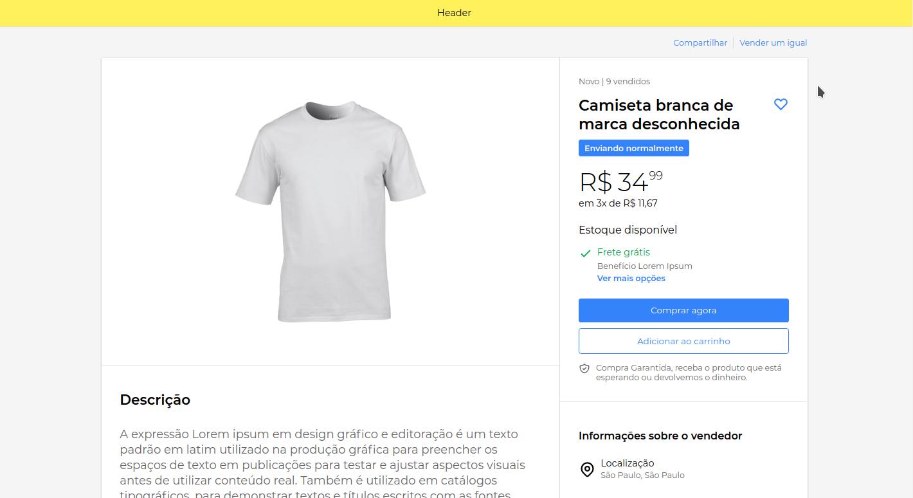

<h1 align="center">
  Mercado livre clone
</h1>

<h1 align="center">
    
    <br>
</h1>

---

### Imagem do Projeto

<div>
  
</div>

### link para testar o projeto

<div>
  <a href="https://herickmercadolivreclone.netlify.app/" >
    
  </a>
</div>

## :rocket: Sobre o Projeto

A proposta foi desenvolver uma interface igual a da pagina de produto do mercado livre

## 👨‍💻️ Tecnogias utilizadas

O projeto foi desenvolvido utilizando as seguintes tecnologias:

- [ReactJS](https://reactjs.org/)
- [TypeScript](https://www.typescriptlang.org/)

## 📦️ Como utilizar o projeto

Para copiar o projeto, utilize os comandos:

```bash
  # Clonar o repositório
  ❯ git clone https://github.com/hericke47/Mercado-Livre.git

  # Entrar no diretório
  ❯ cd Discord-Clone
```
Para instalar as dependências e iniciar o projeto, você pode utilizar o Yarn ou NPM:

**Utilizando yarn**

```bash
  # Instalar as dependências
  ❯ yarn

  # Iniciar o projeto
  ❯ yarn start
```

**Utilizando npm**

*PS: Caso utilize o NPM, apaque o arquivo `yarn.lock` para ter todas as dependências instaladas da melhor forma.*

```bash
  # Instalar as dependências
  ❯ npm install

  # Iniciar o projeto
  ❯ npm start
```

---

## 🤔️ Como contribuir

1. Faça o `fork` deste repositório
2. Crie uma branch com sua feature:
   - `$ git checkout -b minha_feature`
3. Confirme sua branch:
   - `$ git commit -m "feature: Meu novo recurso"`
4. Envie sua branch:
   - `$ git push origin minha_feature`

---
